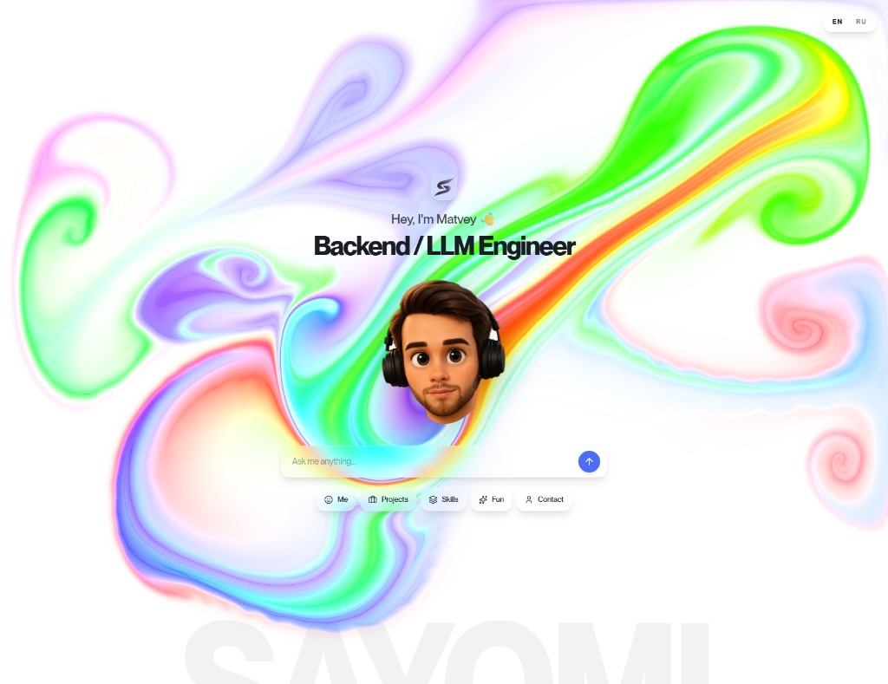
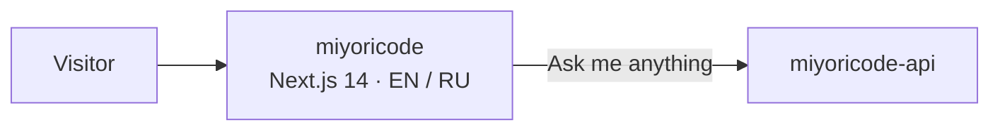

<div align="center">



# Miyori Code

AI-native portfolio of **Matvey** — Backend / LLM Engineer.  
Marble canvas, WebGL fluid cursor, glass dock, EN / RU.

<br />

<table>
  <tr>
    <td align="center" width="50%">
      <strong>Frontend</strong><br />
      this repo<br />
      <a href="https://github.com/sayomiyori/miyoricode">sayomiyori/miyoricode</a>
    </td>
    <td align="center" width="50%">
      <strong>API</strong><br />
      backend<br />
      <a href="https://github.com/sayomiyori/miyoricode-api">sayomiyori/miyoricode-api</a>
    </td>
  </tr>
</table>

<br />

[](https://nextjs.org/)
[](https://www.typescriptlang.org/)
[](https://tailwindcss.com/)
[](https://next-intl.dev/)

</div>

## What this is

A single-screen landing that behaves like a product, not a CV. The ask bar is the entry point — questions go to the [API](https://github.com/sayomiyori/miyoricode-api). Shortcuts (Me, Projects, Skills, Fun, Contact) are the rest of the map.



| Surface | What you get |
| --- | --- |
| Fluid canvas | WebGL ink that follows the pointer |
| Ask bar | Glass input, animated placeholder, send to the API |
| Locale | `en` default, `ru` one click away, cookie-persisted |
| Avatar | Tilted memoji — drop `public/avatar.png` (~280×280) |

## Stack

- **Next.js 14** App Router + TypeScript
- **Tailwind CSS** + glass tokens
- **next-intl** — English / Russian, locale prefix `as-needed`
- **WebGL fluid** cursor on the marble background
- **lucide-react**, `react-parallax-tilt`

Backend lives in a sibling repo: **[miyoricode-api](https://github.com/sayomiyori/miyoricode-api)**.

## Setup

```bash
npm install
cp .env.example .env
npm run dev
```

Open [http://localhost:3000](http://localhost:3000). Russian: [http://localhost:3000/ru](http://localhost:3000/ru).

```env
NEXT_PUBLIC_APP_URL=http://localhost:3000
```

Until `public/avatar.png` is in place, the page uses `public/avatar.svg`.

## Repo map

```
app/           routes, locale layout, /api/health
components/    hero, fluid cursor, lang toggle
i18n/          next-intl routing
messages/      en.json · ru.json
lib/           webgl-fluid, locale helpers
public/        avatar, static assets
```
